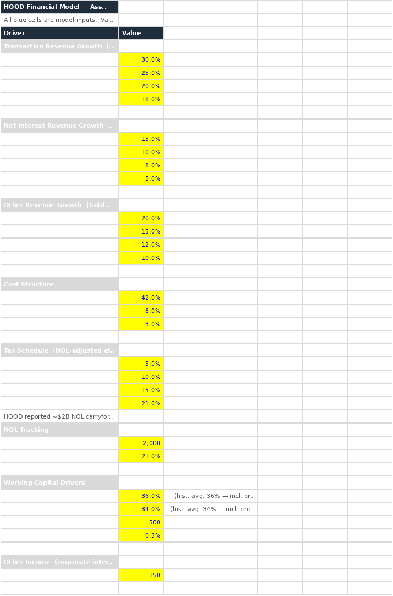
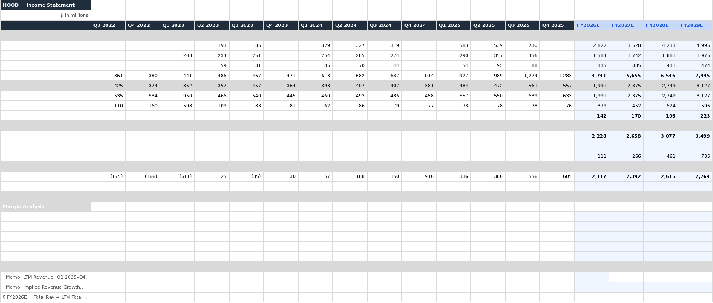
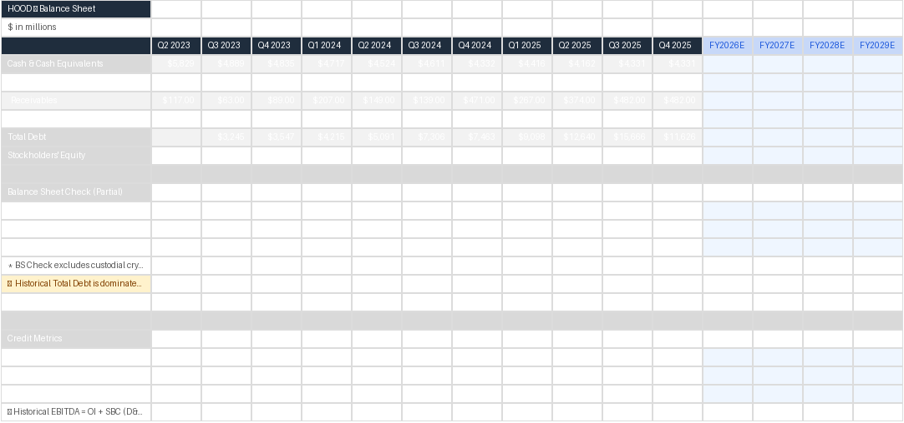
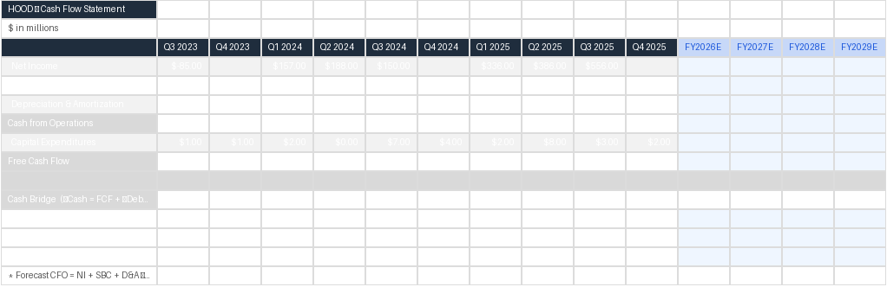
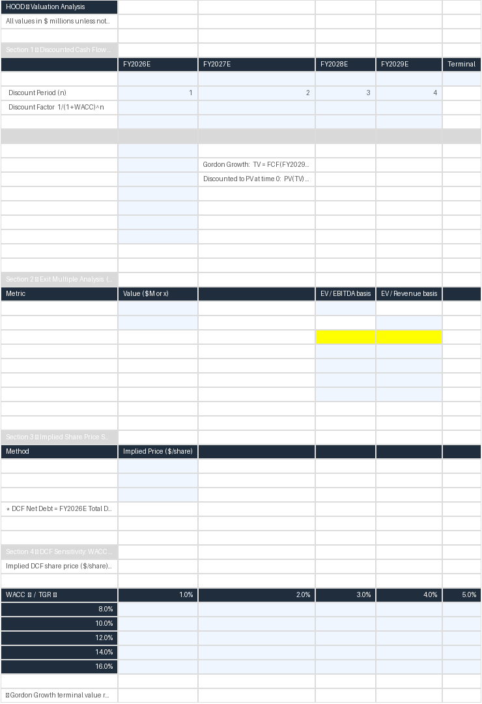
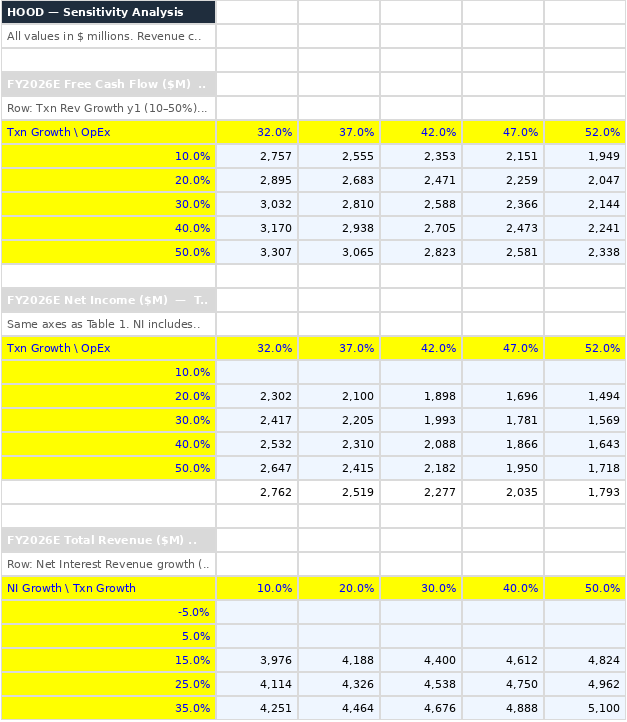
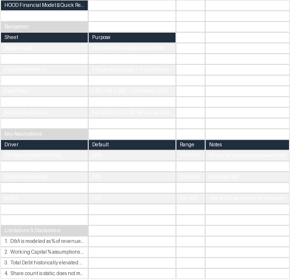

# HOOD Financial Pipeline

A Python pipeline that automates the extraction of Robinhood (HOOD) SEC filings and constructs a professional three-statement financial model in Excel, complete with historical data, four-year forecasts, DCF/exit-multiple valuations, sensitivity analysis, and model integrity checks.

```
SEC EDGAR API --> hood_sec_extract_v3.py --> hood_data_transform.py --> build_excel_model.py
   [pulls 10-Q filings]        [cleans/pivots XBRL]        [constructs 7-sheet Excel]
```

## Screenshots

**Assumptions Sheet** — All model inputs with yellow-highlighted cells and blue input text:



**Income Statement** — 14 quarters historical + 4-year forecast (light blue columns):



**Balance Sheet** — Historical + forecast; cash rolls from FCF, debt as revolver plug, equity updated for NI:



**Cash Flow** — CFO = NI + SBC + D&A - dWC; FCF = CFO - Capex; cash bridge reconciliation:



**Valuation** — DCF, exit multiples, and implied share price:



**Sensitivity Analysis** — Three 5x5 matrices for FCF, Net Income, and Revenue:



**Model Guide** — Navigation, key assumptions summary, and limitations:



## What It Does

This pipeline automates what traditionally takes an analyst days of manual Excel work:

1. **Extract** — Connects to SEC EDGAR APIs, downloads 10-Q filings, and parses both XLSX financial reports and XBRL CompanyFacts data. Handles YTD-to-quarterly conversions and derives Q4 figures from 10-K annual data.

2. **Transform** — Cleans and normalizes raw SEC data into standardized financial statements (Income Statement, Balance Sheet, Cash Flow) with canonical line-item labels and consistent quarterly periods.

3. **Build** — Generates a 7-sheet Excel financial model where all forecast cells use live Excel formulas referencing a centralized Assumptions sheet. Supports bull/base/bear scenarios via YAML configuration.

4. **Validate** — Runs 27 integrity checks covering file presence, structural correctness, formula linkages, cross-statement tie-outs (FCF = CFO - Capex, NI consistency), and assumption bounds.

## Output Workbook (7 Sheets)

| Sheet | Purpose |
|-------|---------|
| **Assumptions** | All model inputs (blue text, yellow fill), NOL depletion schedule, working capital calibration, integrity checks |
| **Income Statement** | 14 quarters historical + 4-year forecast; per-segment revenue, EPS, margin analysis |
| **Balance Sheet** | Historical + forecast; cash rolls from FCF, debt as revolver plug, equity updated for NI |
| **Cash Flow** | CFO = NI + SBC - dAR + dAP; FCF = CFO - Capex; explicit D&A treatment |
| **Valuation** | DCF analysis, exit multiple scenarios, implied share price summary |
| **Sensitivity Analysis** | Three 5x5 matrices: FCF, net income, and revenue sensitivity with conditional formatting |
| **Model Guide** | Navigation, key assumptions summary, audit documentation |

## Key Modeling Choices

- **Per-segment revenue forecasting** with stepped-down annual growth rates (transaction-based, net interest, other)
- **NOL tax ramp** (5% -> 10% -> 15% -> 21%) reflecting ~$2B in accumulated carryforwards through FY2023
- **D&A modeled at 3% of revenue** — HOOD does not separately report depreciation in XBRL filings; assumption consistent with asset-light fintech peers
- **Working capital calibrated** to historical brokerage settlement ratios (~36% receivables, ~34% payables as % of revenue)
- **Zero hardcoded forecast values** — every forecast cell references the Assumptions sheet
- **Three-statement integration** with circular guard (flat interest avoids debt-dependency loops)
- **OpEx / SBC split** — HOOD's XBRL OperatingExpenses includes stock-based compensation; this model separates them for visibility
- **Scenario analysis** — Bull, base, and bear cases driven by `scenarios.yaml` with validated assumption bounds

## Assumptions Reference

| Driver | Base Case | Notes |
|--------|-----------|-------|
| Txn Revenue Growth | 30% / 25% / 20% / 18% | Stepped down annually |
| Net Interest Growth | 15% / 10% / 8% / 5% | Rate-cycle normalization |
| Other Revenue Growth | 20% / 15% / 10% / 8% | Subscription + Gold |
| OpEx (% Rev, ex-SBC) | 42% | Calibrated to historical ex-SBC ratio |
| SBC (% Rev) | 8% | Declining from peak levels |
| D&A (% Rev) | 3% | Asset-light proxy |
| Tax Rate | 5% / 10% / 15% / 21% | NOL depletion ramp |
| AR (% Rev) | 36% | Brokerage settlement cycle |
| AP (% Rev) | 34% | Brokerage settlement cycle |
| Minimum Cash | $500M | Operating floor |
| Capex (% Rev) | 0.3% | Asset-light model |
| Diluted Shares | 1,100M | Fully diluted |
| WACC | 12% | Cost of equity (no debt) |
| Terminal Growth | 3% | Long-run GDP+ |
| Exit Multiple | 20x EBITDA / 5x Revenue | Cross-check vs. DCF |

## Audit Notes

1. **Total Debt Clarification** — The reported $10-16B reflects securities-lending collateral liabilities, not corporate debt. The forecast uses a revolver plug at minimum cash levels instead.

2. **Working Capital Context** — Receivables/Revenue (~36%) and Payables/Revenue (~34%) are elevated relative to peers due to T+1/T+2 settlement cycles typical in brokerage operations.

3. **D&A Treatment** — HOOD does not separately report depreciation and amortization in XBRL filings, so the model uses a 3% revenue assumption consistent with asset-light fintech peers.

4. **SBC Double-Count Prevention** — Operating expenses in XBRL include stock-based compensation; the model separates these using independent percentage-of-revenue assumptions to avoid double-adding in cash flow.

5. **NOL Tax Impact** — With ~$2B in accumulated net operating losses through FY2023, statutory 21% tax rates would overstate cash taxes by $100M+ annually in the near term, hence the phased escalation.

## Project Structure

```
hood-financial-model/
├── .github/workflows/ci.yml    # GitHub Actions CI pipeline
├── assets/                     # Excel model screenshots
├── src/
│   ├── hood_sec_extract_v3.py  # SEC EDGAR XBRL extraction (2,200+ lines)
│   ├── hood_data_transform.py  # Raw -> model-ready CSV transformation
│   ├── build_excel_model.py    # 7-sheet Excel model builder (3,000+ lines)
│   ├── validate_model.py       # 27 integrity checks
│   └── pipeline.py             # Orchestration (extract -> transform -> build -> validate)
├── config/
│   ├── config.py               # Shared layout constants (single source of truth)
│   └── scenarios.yaml          # Bull / base / bear assumption overrides
├── tests/
│   └── test_pipeline.py        # pytest suite (integration, transform, build, validation)
├── data/                       # Generated CSVs (gitignored)
├── output/                     # Generated Excel workbooks (gitignored)
├── Makefile                    # Individual stage targets
├── pyproject.toml              # Project metadata, ruff & pytest config
├── requirements.txt            # Pinned dependencies
├── .pre-commit-config.yaml     # Code quality hooks (ruff, trailing whitespace)
└── LICENSE                     # MIT
```

## Quick Start

```bash
# Clone and set up
git clone https://github.com/arios37/hood-financial-pipeline.git
cd hood-financial-pipeline
python -m venv venv
source venv/bin/activate    # macOS/Linux
pip install -r requirements.txt

# Set your SEC contact (required by EDGAR robots.txt)
export SEC_USER_AGENT="Your Name your@email.com"

# Run the full pipeline
make build

# Or run individual stages
make extract      # Pull 10-Q filings from SEC EDGAR (~2-5 min)
make transform    # Clean XBRL CSVs -> model-ready format
make model        # Generate Excel workbook
make validate     # Run 27 integrity checks
make test         # Run pytest suite
make clean        # Remove generated outputs
```

### Skip Extraction (Use Existing Data)

```bash
python main.py --skip-extract
```

## Scenario Analysis

Generate bull or bear case workbooks:

```bash
python -m src.build_excel_model --scenario bull
python -m src.build_excel_model --scenario bear
```

Scenarios are defined in `config/scenarios.yaml`. Each scenario overrides specific assumptions (growth rates, OpEx margins, WACC, terminal growth) while inheriting all other defaults.

## Testing

```bash
pytest tests/ -v
```

The test suite covers integration (full pipeline), transform data quality, Excel structural integrity, formula verification, and scenario configuration validation.

## Tech Stack

- **Python 3.11+** with type hints throughout
- **pandas** — data manipulation and CSV processing
- **openpyxl** — Excel workbook generation with formulas, formatting, and conditional formatting
- **requests + lxml** — SEC EDGAR API access and XBRL/HTML parsing
- **PyYAML** — scenario configuration
- **pytest** — test suite with session-scoped fixtures and coverage support
- **ruff** — linting and formatting
- **mypy** — static type checking

## License

[MIT](LICENSE)
